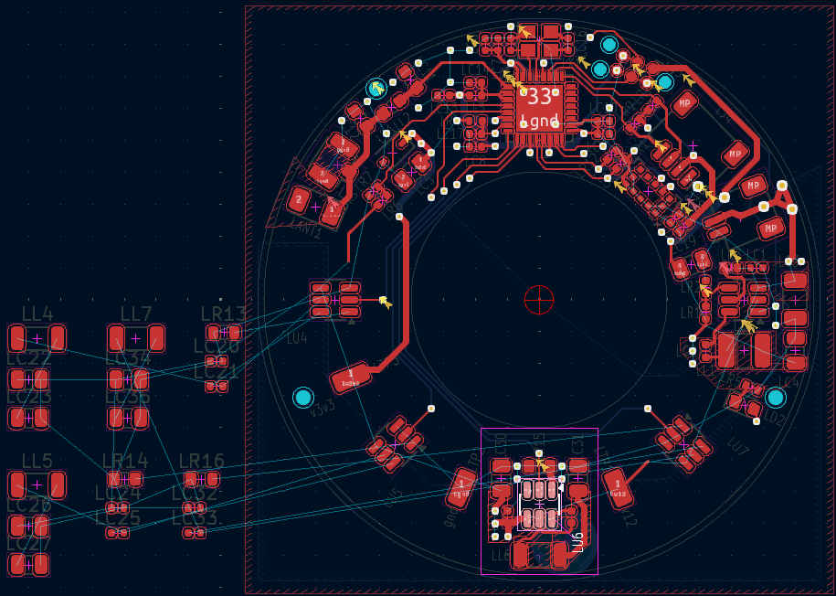
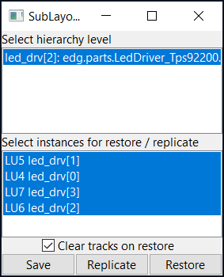
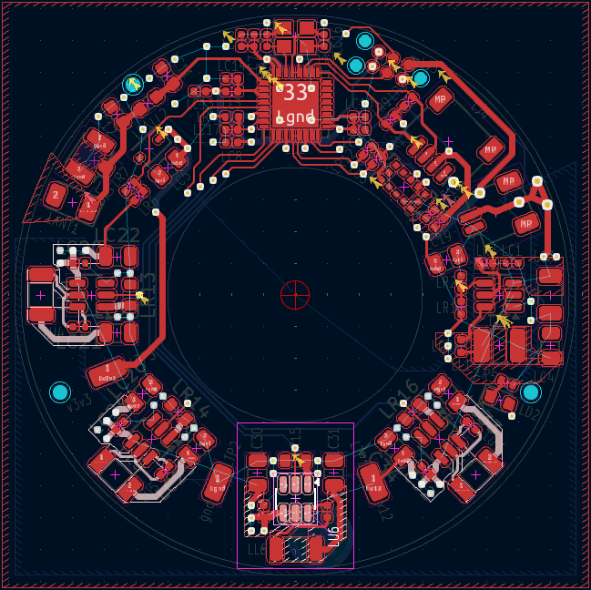
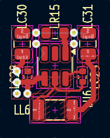

# SubLayout
KiCad plugin to merge (or create) a sub-pcb-layout into (or from) a top-level board, following the hierarchical sheet structure of the board. Compatible with schematic-less (netlist import) flows that encode hierarchical tstamp data.

Tested compatible with KiCad 8 and 10. Zone replication is broken on KiCad 10 due to plugin API changes.

KiCad 10 introduces native [design blocks](https://docs.kicad.org/10.0/en/pcbnew/pcbnew.html#pcb-design-blocks), which this plugin largely replicates.
This plugin may still be useful for schematic-less (netlist import) design flows, since the design blocks workflow is smoothest with schematic integration.
This also provides a lightweight interface that works with individual sublayout .kicad_pcb files, without needing the heavyweight design blocks library machinery.

Inspired by [SaveRestoreLayout](https://github.com/MitjaNemec/SaveRestoreLayout) and [HierarchicalPcb](https://github.com/gauravmm/HierarchicalPcb), but this plugin only uses the board layout file and does not require a schematic or any project structure.

<table>
<tr>
<td><b>Select anchor footprint ...</b>

</td>
<td><b>... invoke plugin ...</b>

</td>
<td><b>... profit</b>

</td>
</tr>

<tr>
<td/>
<td/>

<td><b>... or save sublayout</b>

as an editable .kicad_pcb file, restore-able to another board

</td>

</tr>
</table>

## Features
- Select and save the layout of a hierarchical block to a .kicad_pcb file.
  - Selection includes traces, vias, and zones of internal nets.
  - Selection expands to layout groups enclosing the footprints.
  - This file can be edited.
- Restore a saved layout to a hierarchical block of a board.
  - This includes footprint positions, traces, vias, and zones.
  - Optionally delete existing internal traces and groups (if applicable) before restoring
- Replicate a layout of a hierarchical block to other instances of that block in the same board. 
- Flexible matching by either hierarchical tstamp (component unique IDs) or relative refdes. 
  - Best-effort restore when the footprints or netlists do not match, allowing partial restores when the hierarhical sheet schematic has changed.

## Workflow
1. Select ONE anchor footprint.
   - Saving: select any footprint in the hierarchical block to be saved.
   - Restoring: select the footprint in the hierarchical block where the layout will be restored around.
   - Replicating: select the footprint of the source hierarchical block corresponding to the footprints of the instances where the layouts will be replicated around.
2. Invoke the plugin from the plugin menu or toolbar.
3. If needed, change the level of hierarchy to operate on.
   By default, the lowest (leaf-most) hierarchical block is selected.
4. Optionally, select multiple instances of the hierarchical block to replicate or restore.
5. Click 'Save', 'Replicate' or 'Restore' to perform the operation.

## Installation
_TODO: make available on the KiCad plugin / package manager_

Clone this repository into your KiCad plugins directory.
- On Windows, this is typically `C:\Users\<username>\Documents\KiCad\8.0\scripting\plugins`, and if cloned correctly, this file should exist: `C:\Users\<username>\Documents\KiCad\8.0\scripting\plugins\SubLayout\plugin.py`.

## Board Requirements
- Sublayouts work on hierarchical sheets.
  - For non-schematic flows (e.g., hardware description language to netlist to layout), netlists must encode hierarchy in footprint tstamp (component unique id) data and provide Sheetfile and Sheetname.
- In tstamp mode: component unique IDs must match when restoring or replicating sublayouts.
  - For non-schematic flows, this means footprint tstamp data must match.
- Alternatively, in refdes mode: relative component reference designators are used to match components between instances.
- Sheetname inference may fail if there are hierarchical sheets with no direct footprints.
  This may result in not finding other instances of a hierarhical sheet and is a limitation of the data available in the board layout file.
